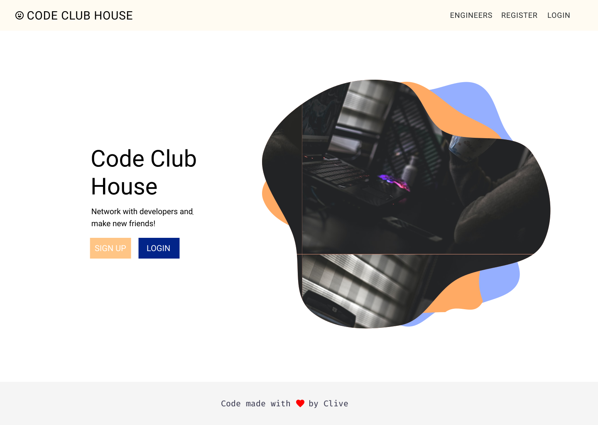

# Purpose

Code Club House's purpose is to have a place where software engineering students can connect and share their learning experience.

# Technologies used:

Here are some of the technologies used:

This project was bootstrapped with [Create React App](https://github.com/facebook/create-react-app) and Redux for state managment.

MongoDB for the backend.

[Font Awesome](https://fontawesome.com/) was also used.

Wireframe created using [Figma](https://www.figma.com/file/3t3SQbi2VcrhAWuoOdzXy1/Mod2_project?node-id=0%3A1)

Heroku was used to deploy the app:

Click this link to view the [Mod 2 Project](https://lit-inlet-84195.herokuapp.com/)

See below for a gif of the app:

See below for a mockup of the app:

# The approach taken:

I used a trello board to organize tasks from the user stories to complete.

I used figma to create the design for the components.

I built out the backend first useing MongoDB and ExpressJS.

Then I build the frontend using ReactJS and Redux.

# Unsolved problems:

Deploying the app was a bit difficult at first but I was able to solve that issue through research.

I discovered that you can create a script that can run in the backend on Heroku to create the static files to then render the website.

# User stories:

User Story: Design in Figma 
User Story: Create navbar 
User Story: Connect MongoDB Database for backend 
User Story: npm install mongoose for data modeling 
User Story: Uses React, and Redux 
User Story: Using a 3rd party api (Github and the backend) 
User Story: Make use of async actions to send data to and receive data from a server 
User Story: Project code is pushed to a public Git repository 
User Story: Use the create-react-app generator to start your project. 
User Story: Follow the instructions on this repo to setup the generator: create-react-app 
User Story: Your app should have one HTML page to render your react-redux application 
User Story: The Application must make use of react-router and proper RESTful routing 
User Story: Incorporating a new technology not taught in the program 
User Story: App renders in browser 
User Story: Be able to register as a user 
User Story: User is logged in or user is logged out 
User Story: The code should be written in ES6 as much as possible 
User Story: There should be 2 container components 
User Story: There should be 5 stateless components 
User Story: There should be 3 or more routes 
User Story: Use Redux middleware to respond to and modify state change 
User Story: Your client-side application should handle the display of data with minimal data manipulation 
User Story: Has readme.md file at the root of repository 
User Story: readme file clearly documents the purpose of the project as a problem statement 
User Story: readme file has embedded link (not url) to publicly deployed app

# Notes:

This took quite a bit of time to make. I need to add some more components but for the most part it is complete.
